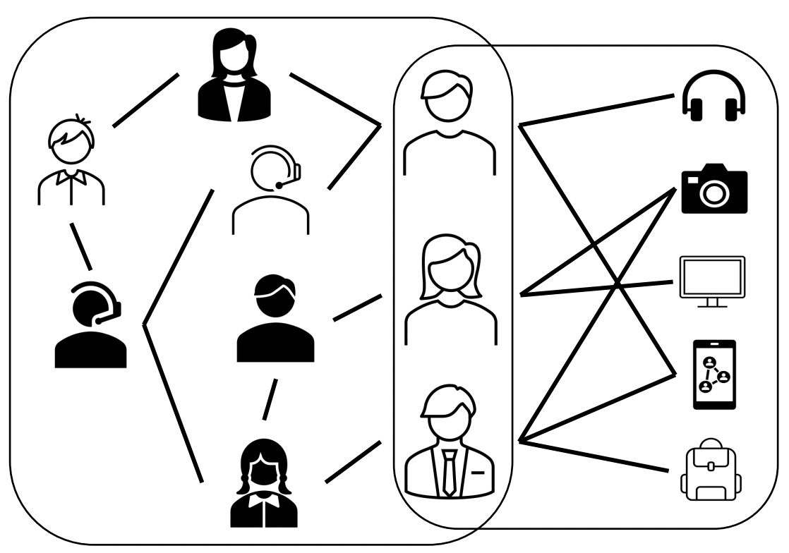
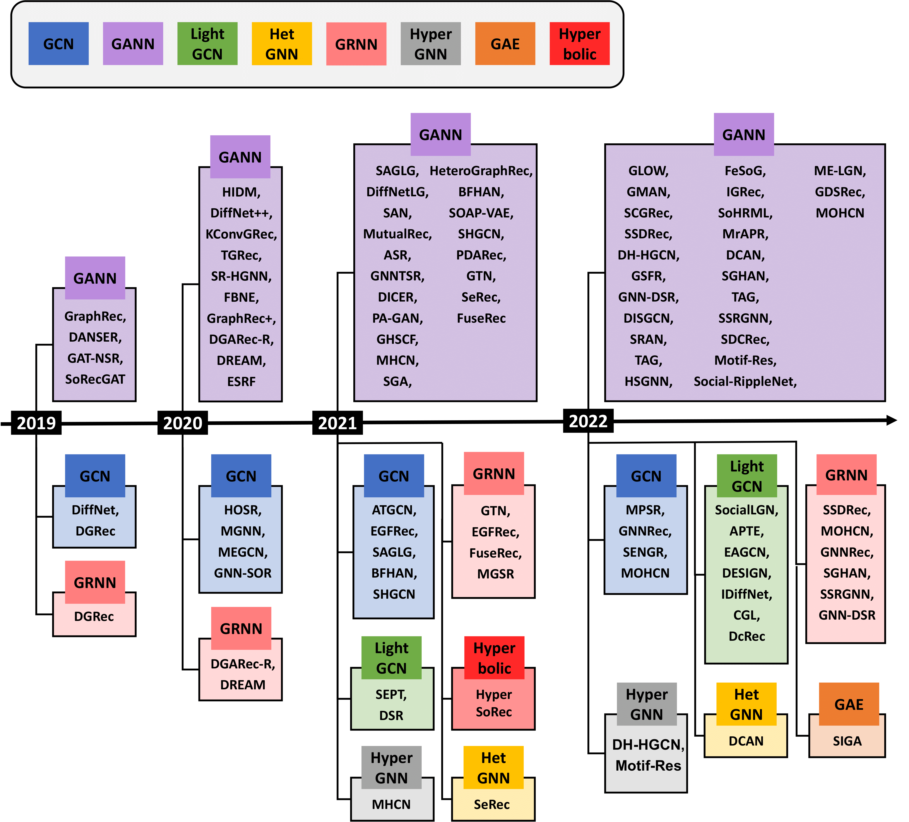

# GNN-based Social Recommender Systems

A curated list of papers on GNN-based social recommender systems. 

Social recommender systems use user-user social links in addition to user-item interaction edges to make effective recommendation. 
This is illustrated in the diagram shown below, as it forms a user-item bipartite graph along with a relational graph induced by the social network. 

Over the past few years, Graph Neural Networks (GNNs) have emerged as the standard way to encode graphs. 

This repo, which accompanies our [survey on the topic](https://arxiv.org/abs/2212.04481), inludes over 80 papers that use Graph Neural Network for the task of social recommendation. 

You may refer to the survey for novel taxonomies to categorize these papers based on inputs, input representations, architectures (both encoders and decoders), and loss functions.  

## Citation
```
> @article{sharma2021task,
   title={A Survey of Graph Neural Networks for Social Recommender Systems},
   author={Sharma, Kartik and Lee, Yeon-Chang and Nambi, Sivagami and Salian, Aditya and Shah, Shlok and Kim, Sang-Wook and Kumar, Srijan},
   journal={arXiv preprint arXiv:2212.04481},
   year={2022} 
 }
 ```


  
&nbsp;


## Quick Links
Papers sorted by year: <a href="#2022">2022</a> | <a href="#2021">2021</a> | <a href="#2020">2020</a> | <a href="#2019">2019</a>

## 2022  
[[Back to top](#quick-links)]
|Year|Model|Venue|Paper|
|--|--|--|--|
|2022|MOHCN|IEEE Access|https://ieeexplore.ieee.org/stamp/stamp.jsp?tp=&arnumber=9858144|
|2022|MrAPR|ICPCSEE|https://link.springer.com/chapter/10.1007/978-981-19-5194-7_10|
|2022|DISGCN|IEEE TKDE|https://ieeexplore.ieee.org/stamp/stamp.jsp?tp=&arnumber=9827970|
|2022|GNNRec|Journal of Intelligent Information Systems|https://link.springer.com/content/pdf/10.1007/s10844-022-00733-5.pdf|
|2022|DCAN|ICDE|https://ieeexplore.ieee.org/stamp/stamp.jsp?tp=&arnumber=9835273|
|2022|SGHAN|IEEE Transactions on Services Computing|https://ieeexplore.ieee.org/stamp/stamp.jsp?tp=&arnumber=9852695|
|2022|TAG|IEEE TKDE|https://ieeexplore.ieee.org/stamp/stamp.jsp?tp=&arnumber=9844848|
|2022|SSRGNN|ICCS|https://link.springer.com/chapter/10.1007/978-3-031-08757-8_46|
|2022|Social-RippleNet|Applied Intelligence|https://link.springer.com/content/pdf/10.1007/s10489-022-03620-2.pdf|
|2022|ME-LGN|DASFAA|https://link.springer.com/chapter/10.1007/978-3-031-00126-0_9|
|2022|GNN-DSR|DASFAA|https://arxiv.org/pdf/2201.10751.pdf|
|2022|GDSRec|IEEE TKDE|https://ieeexplore.ieee.org/stamp/stamp.jsp?tp=&arnumber=9721542|
|2022|SIGA|Applied Intelligence|https://link.springer.com/content/pdf/10.1007/s10489-022-03748-1.pdf|
|2022|DcRec|CIKM|https://arxiv.org/pdf/2208.08723.pdf|
|2022|FBNE|IEEE TKDE|https://ieeexplore.ieee.org/stamp/stamp.jsp?tp=&arnumber=9050415|
|2022|HSGNN|IEEE TNSM|https://ieeexplore.ieee.org/stamp/stamp.jsp?tp=&arnumber=9810972|
|2022|CGL|Frontiers in Physics|https://www.frontiersin.org/articles/10.3389/fphy.2022.830805/full|
|2022|EAGCN|IEEE Internet of Things Journal|https://ieeexplore.ieee.org/document/9714267|
|2022|SRAN|ICCAI|https://dl.acm.org/doi/pdf/10.1145/3532213.3532259|
|2022|SocialLGN|Information Sciences|https://www.sciencedirect.com/science/article/abs/pii/S0020025522000019|
|2022|MPSR|Neurocomputing|https://www.sciencedirect.com/science/article/pii/S0925231221015368|
|2022|GLOW|Pattern Recognition|https://www.sciencedirect.com/science/article/abs/pii/S0031320322000826|
|2022|GMAN|Information Processing and Management|https://www.sciencedirect.com/science/article/pii/S0306457321002752|
|2022|GraphRec++|IEEE TKDE|https://ieeexplore.ieee.org/abstract/document/9139346|
|2022|SCGRec|WWW|https://dl.acm.org/doi/pdf/10.1145/3485447.3512273|
|2022|DH-HGCN|ACM SIGIR|https://dl.acm.org/doi/pdf/10.1145/3477495.3531828|
|2022|Motif-Res|Neurocomputing|https://www.sciencedirect.com/science/article/pii/S0925231222011948|
|2022|GSFR|Expert Systems with Applications|https://www.sciencedirect.com/science/article/pii/S0957417422009204|
|2022|IDiffNet|Journal of Intelligent Information Systems|https://link.springer.com/article/10.1007/s10844-021-00684-3|
|2022|APTE|Pattern Recognition Letters|https://www.sciencedirect.com/science/article/pii/S0167865522002495#!|
|2022|FeSoG|ACM TIST|https://arxiv.org/pdf/2111.10778.pdf|
|2022|IGRec|Knowledge-Based Systems|https://www.sciencedirect.com/science/article/pii/S0950705122004415|
|2022|ESRF|IEEE TKDE|https://arxiv.org/pdf/2004.02340.pdf|
|2022|SDCRec|ACM SIGIR|https://dl.acm.org/doi/pdf/10.1145/3477495.3531780|
|2022|SoHRML|Knowledge and Information Systems|https://link.springer.com/content/pdf/10.1007/s10115-022-01680-x.pdf|
|2022|DSR|IEEE Transactions on Computational Social Systems|https://ieeexplore.ieee.org/stamp/stamp.jsp?tp=&arnumber=9528836|
|2022|DESIGN|WWW|https://dl.acm.org/doi/pdf/10.1145/3485447.3512003|
|2022|SENGR|Information Sciences|https://www.sciencedirect.com/science/article/pii/S0020025521013414|
|2022|HOSR|IEEE TKDE|https://arxiv.org/pdf/2003.10149.pdf|
|2022|SSDRec|Applied Soft Computing|https://www.sciencedirect.com/science/article/pii/S1568494622000291|

## 2021
[[Back to top](#quick-links)]
|Year|Model|Venue|Paper|
|--|--|--|--|
|2021|SEPT|KDD|https://dl.acm.org/doi/pdf/10.1145/3447548.3467340|
|2021|MGSR|ICAA|https://ieeexplore.ieee.org/abstract/document/9653534|
|2021|FuseRec|DMKD|https://link.springer.com/article/10.1007/s10618-021-00738-8|
|2021|EGFRec|Neurocomputing|https://www.sciencedirect.com/science/article/pii/S0925231220312832?casa_token=__fLWNe4HBIAAAAA:ZRdOoh7yae2vF7YnfzhAWBtIzsks28OQfJejyZ2O_iKqEuBLWU7Wp1IidkgOGOvtRV9IKp42yw|
|2021|SeRec|WSDM|https://dl.acm.org/doi/pdf/10.1145/3437963.3441792?casa_token=gsXXOYOY30AAAAAA:GPvVc0dqRPktdAc1zChZAsWdMjlZ4REYD5g9DZpTBumS76Pn1D1mDVKvCf9GTbbQ5ln1a1F7bpbaDA|
|2021|GTN|KSE|https://ieeexplore.ieee.org/abstract/document/9648823|
|2021|PDARec|BigDIA|https://ieeexplore.ieee.org/abstract/document/9619671|
|2021|SHGCN|arXiv preprint|https://arxiv.org/abs/2111.03344|
|2021|SOAP-VAE|International Journal of Intelligent Systems|https://onlinelibrary.wiley.com/doi/abs/10.1002/int.22444|
|2021|MHCN|WWW|https://dl.acm.org/doi/pdf/10.1145/3442381.3449844|
|2021|HeteroGraphRec|Knowledge-Based Systems|https://www.sciencedirect.com/science/article/pii/S0950705121000800?casa_token=4f5EATDG07QAAAAA:f9YbYrNKQWdfv1BI5VqNvCInk5dK3O77hpZk3jX5jdssTX7c-nTWHJ_34sfx6xotyOg4xH0xJA|
|2021|BFHAN|ACM TOIS|https://dl.acm.org/doi/abs/10.1145/3469799|
|2021|SAGLG|IEEE TNSE|https://ieeexplore.ieee.org/abstract/document/9531473|
|2021|Diffnet-LG|ACM SIGIR|https://dl.acm.org/doi/pdf/10.1145/3404835.3463043?casa_token=lkyy_lbDFngAAAAA:sdXtAm4k3RPXDfbKmV-OLCSGuaQw2wfT99nu8CRiwCn-Ckx7vgbq9meD1ZPSJX62ai3A3WkdGBIx5g|
|2021|MutualRec|Journal of Network and Computer Applications|https://www.sciencedirect.com/science/article/pii/S1084804520304070?casa_token=TFLD46EFil8AAAAA:tEoU1o6RgmfKDVkeyobks12REjgdmW3oSsZA_NyNIX-Ak5PFImY3lw9mC55g_bke_TifZ8Hetg|
|2021|SAN|International Journal of Intelligent Systems|https://onlinelibrary.wiley.com/doi/abs/10.1002/int.22694?casa_token=XAW0_pYbUKcAAAAA%3AG32b2GKYO3u-_387mUY-LwJUW-d3xbmSieOvvHyEr_4uYnCnrxhaqWVYtkUdcUkL7Vwk3wchmdcUWn_D|
|2021|GNNTSR|IEEE IJCNN|https://ieeexplore.ieee.org/document/9533367|
|2021|DICER|WWW|https://dl.acm.org/doi/pdf/10.1145/3442381.3449940?casa_token=C0niSuC2iNkAAAAA:LnF1JxuktyY_4KOoCeOoYohBa9rMaje2wF_qNoXaZO8S2vdJ8fedRt7bbkjPgzmBUtQTAj1WM9wR5w|
|2021|PA-GAN|Journal of Physics: Conference Series|https://iopscience.iop.org/article/10.1088/1742-6596/1848/1/012141/pdf|
|2021|GHSCF|Wireless Communications and Mobile Computing|https://www.hindawi.com/journals/wcmc/2021/9107718/|
|2021|ASR|Neurocomputing|https://www.sciencedirect.com/science/article/pii/S0925231221004628?casa_token=hYAWJz7TuiUAAAAA:Rp_B7GNTUr1DpTbEMmkJD6KeDIEamc8DegIpeeumpqhfHCp9O_oeXh008uWP8rG8nL2SKiWP7g|
|2021|ATGCN|IEEE Access|https://ieeexplore.ieee.org/stamp/stamp.jsp?arnumber=9499073|
|2021|SGA|PDCAT|https://link.springer.com/chapter/10.1007/978-3-030-96772-7_34|
|2021|SPEX|ACM Transactions on Information Systems|https://dl.acm.org/doi/pdf/10.1145/3473338|
|2021|HyperSoRec|ACM TOIS|http://staff.ustc.edu.cn/~qiliuql/files/Publications/Hao-Wang-TOIS21.pdf|

## 2020
[[Back to top](#quick-links)]
|Year|Model|Venue|Paper|
|--|--|--|--|
|2020|DREAM|CIKM|https://arxiv.org/pdf/2008.04579.pdf|
|2020|MEGCN|CIKM|https://dl.acm.org/doi/pdf/10.1145/3340531.3412016?casa_token=Fm0DDhNV--UAAAAA:zkGFGffGmb3rPyytwynfSorvKbCtJnIP2fdAIAIjMpGCIBbuhboUhiQ0BH3hJN7pFhOn4VIZ5Pj_dw|
|2020|DGARec-R|IEEE ISPA/BDCloud/SocialCom/SustainCom|https://ieeexplore.ieee.org/abstract/document/9443760|
|2020|TGRec|IEEE BigData|https://ieeexplore.ieee.org/document/9378444|
|2020|GNN-SOR|IEEE Transactions on Industrial Informatics|https://ieeexplore.ieee.org/document/9063418|
|2020|Diffnet++|IEEE TKDE|https://ieeexplore.ieee.org/document/9311623|
|2020|HIDM|IEEE ICTAI|https://ieeexplore.ieee.org/document/9288294|
|2020|KConvGraphRec|CSoNet|https://link.springer.com/chapter/10.1007/978-3-030-66046-8_6|
|2020|MGNN|IEEE Intelligent Systems|https://ieeexplore.ieee.org/document/9078079|
|2020|SR-HGNN|IEEE ICDM|https://ieeexplore.ieee.org/document/9338365|

## 2019
[[Back to top](#quick-links)]
|Year|Model|Venue|Paper|
|--|--|--|--|
|2019|Diffnet|ACM SIGIR|https://dl.acm.org/doi/pdf/10.1145/3331184.3331214?casa_token=nivDVWLpW1cAAAAA:xdz-72bUnvPFsJbUr69x7eVoDWw_tyZh4zIvnkjT7l4HQB2bfyN-MC5uz8rsssGQSbJYwjqZx4RzlQ|
|2019|GraphRec|WWW|https://dl.acm.org/doi/pdf/10.1145/3308558.3313488?casa_token=pwOzVIgv8YYAAAAA:d5YTkdzzab0g0dE0wGdlp7oJ5gKgiSPHrC2IFVjY2eGnzyl5Z-m2IhZJqgNKBPVqTSdIBqAI1uN1Ow|
|2019|DANSER|WWW|https://dl.acm.org/doi/pdf/10.1145/3308558.3313442?casa_token=zllzPk1e4xsAAAAA:GRBUElEZiwBJ2WXp3ZbTe_DJalynQYWW-tQsr3afmAgVacaRD7Y4DRvdi7pk_ou1JiTzXK_JaOatuw|
|2019|GAT-NSR|IEEE ICTAI|https://ieeexplore.ieee.org/document/8995280|
|2019|SoRecGAT|ECML-PKDD|https://www.ecmlpkdd2019.org/downloads/paper/475.pdf|
|2019|DGRec|WSDM|https://arxiv.org/pdf/1902.09362.pdf|
